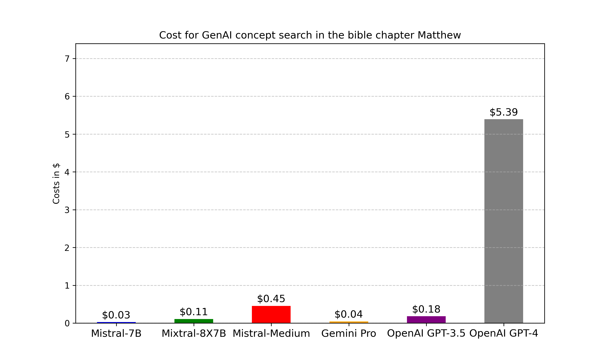

# Concept search powered by Large Language Models

In this repository, I explore the Idea of a concept search with Large Language Models.  
Instead of an exact word match or an intelligent full-text search, I search the text for representing a concept or Idea. 

In this experiment, the Bible is searched for the concept of __seeking discomfort__.  
For this, I go through every verse and let a large Language Model rate how much this verse represents the concept of seeking discomfort.
With this technique, I will also discover verses like Matthew 7:13-14
> Enter through the narrow gate. For wide is the gate and broad is the road that leads to destruction, and many enter through it. But small is the gate and narrow the road that leads to life, and only a few find it.

I think this verse represents the Idea of seeking discomfort well, but there is no intelligent search available, that would be able to find this.

However, the main purpose of this repository is to experiment with Large Language models and different API

- [Concept search powered by Large Language Models](#concept-search-powered-by-large-language-models)
  - [Comparison of the models](#comparison-of-the-models)
    - [Cost](#cost)
    - [Speed](#speed)
    - [Performance](#performance)
    - [Reliability](#reliability)
  - [General Findings](#general-findings)
    - [Performance (Speed)](#performance-speed)
    - [Prompt Engineering](#prompt-engineering)
      - [scoring to 100 does not work](#scoring-to-100-does-not-work)
    - [Authentication](#authentication)
      - [Google Cloud](#google-cloud)
      - [OpenAI](#openai)
  - [Lessons learned](#lessons-learned)
    - [Safety](#safety)
    - [Rate Limiting](#rate-limiting)

## Comparison of the models

Tested LLMS:

- Google VertexAi:
  - PaLM 2
  - GeminiPro
- OpenAi
  - GPT3.5
- mistral.ai
  - mistral-tiny (mistral 7B)
  - mistral-small (mixtral 8x7B)
  - mistral-medium
- local (with Ollama)
  - mistral 7B
  - Llama 7B
  - Llama 13B

### Cost

Here is a comparison of the costs for the tested LLMS models:


### Speed

The mistral.ai API gave the fastest answers.
The local Llama 13B took the longest.

### Performance

Below is a table of the top ratings sorted by mistral medium, because based on the public stats, it should be the most powerful model.  Based on this view, it looks like, that llama7B is the closest match to mistral medium, but this is not true, as llama7B gives a rating of 8,7 or 6 to every verse.  Another thing, that is interesting, is that the ratings of mistral-tiny and Ollama mistral7B are different, even though they should be the same underlying model.

| id |   mistral medium |   mistral small |   mistral tiny |   ollama llama13B |   ollama llama7B |   ollama mistral7B |   gpt 3.5 |   gemini pro |   text bison |
|-----:|-------------------------:|------------------------:|-----------------------:|--------------------------:|-------------------------:|---------------------------:|------------------:|---------------------:|---------------------:|
|  551 |                        9 |                       9 |                      1 |                         8 |                        8 |                         10 |                 8 |                    8 |                    8 |
|  133 |                        8 |                       2 |                      1 |                         5 |                        8 |                         10 |                 5 |                    8 |                    5 |
|  548 |                        8 |                       0 |                      1 |                        -1 |                        8 |                         10 |                 5 |                    2 |                    2 |
|  119 |                        8 |                       1 |                      8 |                         5 |                        7 |                          0 |                 5 |                    7 |                    5 |
|  220 |                        8 |                       9 |                      1 |                        -1 |                        7 |                         10 |                 5 |                    0 |                    0 |
|  666 |                        8 |                       0 |                      0 |                        -1 |                        8 |                          0 |                 0 |                    0 |                    0 |
|  310 |                        8 |                       9 |                      8 |                         5 |                        8 |                          5 |                 5 |                    7 |                    5 |
|  311 |                        8 |                       9 |                      5 |                         5 |                        8 |                          5 |                 5 |                    7 |                    5 |
|  130 |                        8 |                       8 |                      0 |                         5 |                        7 |                          0 |                -1 |                    3 |                    5 |
|  552 |                        8 |                       9 |                      8 |                         5 |                        7 |                          5 |                 5 |                    5 |                    0 |
|  946 |                        8 |                       2 |                      8 |                         5 |                        7 |                          5 |                 2 |                    0 |                    0 |
| 1010 |                        8 |                       0 |                      1 |                         5 |                        7 |                         10 |                 0 |                    0 |                    0 |
|  777 |                        8 |                       2 |                      1 |                         5 |                        7 |                         10 |                 2 |                    0 |                    0 |
|  384 |                        8 |                       1 |                      0 |                        -1 |                        7 |                          0 |                 2 |                    0 |                    0 |
|  659 |                        8 |                       2 |                      8 |                        -1 |                        7 |                          2 |                 2 |                    0 |                    0 |
|  807 |                        8 |                       2 |                      1 |                        -1 |                        7 |                         10 |                 2 |                    2 |                    5 |
|  646 |                        8 |                       8 |                      1 |                         8 |                        8 |                          5 |                -1 |                    2 |                    0 |
|  638 |                        8 |                       9 |                      8 |                        -1 |                        8 |                          8 |                 8 |                    2 |                    3 |
|  118 |                        8 |                       2 |                      1 |                         5 |                        8 |                         10 |                 5 |                    2 |                    5 |
|  440 |                        8 |                       8 |                      8 |                         5 |                        8 |                          0 |                 8 |      0 |           0 |

### Reliability

In the table where there is a -1 or less, the model failed to output a number with its first 2 tokens.

## General Findings

### Performance (Speed)

Here are a few things I have done to improve the speed and reduce cost:
__limit the output token__ to just 2 and tell the LLM to only output. This results in a __zero-shot reasoning__ task.
Use a __system message__ to give the instructions to the LLM.
The theory behind that is that the LLM can precompute part of the Attention matrix because the system message does not change. This only works, if the LLM is set up to cache the pre-computed attention matrix

### Prompt Engineering

I use the following system prompt:
> """You are an expert in the understanding and interpretation of the English language. You will get a single verse of the bible as an input and respond only with a single number from 0 to 10, representing
how much the given bible verse says about the concept of seeking discomfort. It is irrelevant if the verse suggests that seeking discomfort is good or bad.
For every prompt you will answer with just one number (0 to 10). 0 represents the lowest correlation to the concept of seeking comfort or
seeking discomfort and 10 represents the highest correlation to the concept of seeking comfort or seeking discomfort.
Only answer with a single number. Do NOT give any explanation or context.
"""

I prime the model with "You are an expert in the use of the English language" to make sure, it focuses just on the interpretation of verse and not on its prior knowledge of the bible or Christianity.  

#### scoring to 100 does not work

None of the tested models ever scored a score other than a multiple of 10.
I expected the model to first predict the first digit and then finetune its answer with the second token.
This may be because all multiples of 10 consist of just one token.  
In fact, with OpenAIs Tokenizer, all numbers from 0 to 999 have their own token. This may mean, that it makes more sense to just score from 0 to 10.

### Authentication

#### Google Cloud

Create a Service account
<https://console.cloud.google.com/iam-admin/serviceaccounts?hl=en>  
add the role for Vertex-AI-User  
open service account  
select KEYS  
Create New Key
Then the credentials.json file is downloaded  
Save it somewhere  
Then put the path to that file into the environment Variable

```python
os.environ['GOOGLE_APPLICATION_CREDENTIALS'] = 'C:/Git_Repos/try-out-vertex-ai-20aaf5516b7c.json' 
# os.environ['GOOGLE_APPLICATION_CREDENTIALS'] = '/mnt/c/Git_Repos/try-out-vertex-ai-20aaf5516b7c.json'  
```

#### OpenAI

get the API key from <https://platform.openai.com/api-keys>
and then add it to your environment.

```python
os.environ["OPENAI_API_KEY"] = "your-api-key-here"

```

## Lessons learned

### Safety

Their safety is annoying!

Google safety setting
<https://ai.google.dev/tutorials/python_quickstart#safety_settings>
You can remove the blocking by setting safety settings:  
<https://stackoverflow.com/questions/77723993/gemini-pro-api-blocking-replies>

### Rate Limiting

I get rate-limited on PaLM 2 and GeminiPro.
maximum of 60 Requests per minute
<https://cloud.google.com/vertex-ai/docs/generative-ai/quotas-genai?hl=en>  
I could request to up the limit
in the meantime, the limit was lifted

on the Gemini Pro requests, I randomly get some annoying grpc error.
